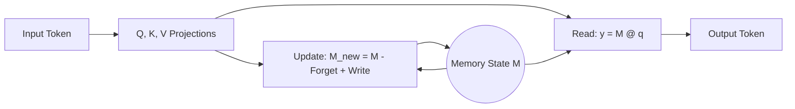

# Nano-HOPE: High-Fidelity Reference Implementation

[](https://opensource.org/licenses/MIT)
[](https://pytorch.org/)
[](https://colab.research.google.com/drive/1IXCZadJB14pqA5d5tgGo3UzQ2B_DTnyR?usp=sharing)

**Author:** Shushank

## Abstract

**Nano-HOPE** is an unofficial, educational, and high-fidelity implementation of the **HOPE** (Higher-Order Policy Engine) architecture. Unlike standard Transformers, HOPE employs a **Self-Modifying Titans Core** that updates its own weights at inference time, allowing it to "learn" from the context dynamically.

This repository implements the exact **L2 Regression / Delta Rule** update mechanism described in the research, optimized for readability and educational value.

## Architecture

### The Self-Modifying Core (TitansL2)

At the heart of Nano-HOPE is the `TitansL2` layer. Instead of static attention, it maintains a memory matrix $M_t$ that evolves according to the **Delta Rule**:

$$ M_{t+1} = M_t - \alpha (M_t k_t) k_t^T + \beta v_t k_t^T $$

Where:
*   $M_t$: The memory state (effectively a weight matrix).
*   $k_t, v_t$: Key and Value vectors at step $t$.
*   $\alpha$: Forget rate (learnable).
*   $\beta$: Write rate (learnable).

This allows the model to explicitly **overwrite** old information with new data, solving the "capacity" problem of standard Linear Attention.



### Continuum Memory System (CMS)

Surrounding the Titans core are **CMS Blocks**—MLPs that operate at different timescales to capture long-term structural knowledge.

## Parameters

| **Parameter**                | **Value**         |
| ---------------------------- | ----------------- |
| Embedding Dimension (n_embd) | 512               |
| Number of Heads (n_head)     | 8                 |
| Number of Layers (n_layer)   | 8                 |
| **Total Parameters**         | **≈51.3 Million** |

## Loss graph


- Trained on learning rate of `3e-4` and `min_lr` = `3e-5`
- Total steps `10,000`
- warmup steps `200`

## Prompt and response 
> Prompt: Once upon a time, 
```text
============================================================
Once upon a time, !" He slide was so nice his he her. too and a. home a
, to.. bringing You it true She find listen hug
 went the a to It time was He it

 everyone bark and that to close asked bread quite much it a bird to! upon He day, was with. started little It, was up a he mom He,
 in the again,.! was by. twins not the
 the Lily Ben smiled him door,... park a in noise,
 and upon He, please " with,. to play a jumped a to be fun looked itWhen. the voice and. was sheAfter is.. was you., to she, the was, was put. even happy
============================================================
```


## Installation

```bash
git clone https://github.com/Sk16er/hope_nano.git
cd hope_nano
pip install -r requirements.txt
```

## Quick Start
## Google coolab 
You can use the google coolab notebook to run the model currently it Have 50M parameter, and took ~ 60 min to devlop the model. "I have added funstion to clear cache bcz it was crasing in the free version". 
so it clear the cuda cache in every 500 steps. 


### 1. Training
Train the model on `TinyStories` with advanced features (Cosine Scheduler, Gradient Clipping):

```bash
python train.py
```

### 2. Stateful Inference (The "Magic")
Run the generation script to see **Stateful Inference** in action. Unlike Transformers that re-process the whole history, HOPE passes a compact state forward.

```bash
python generate.py
```

## Advanced Usage

### Config
Modify `config.py` to change model size or update rules.

```python
@dataclass
class HOPEConfig:
    n_layer: int = 8
    n_head: int = 8
    n_embd: int = 512
    # ...
```

### Model API
The `HOPE` class in `model.py` supports explicit state passing:

```python
# Initial Step
logits, loss, states = model(input_ids)

# Next Step (Pass 'states' to avoid re-computation)
logits, loss, states = model(next_token, states=states)
```
## AI-Written
Hey guys, I had an AI editor review the code for potential errors and add explanatory comments. It generated the comments for clarity because I was too lazy to write them myself.

# Please gave it a star ⭐
