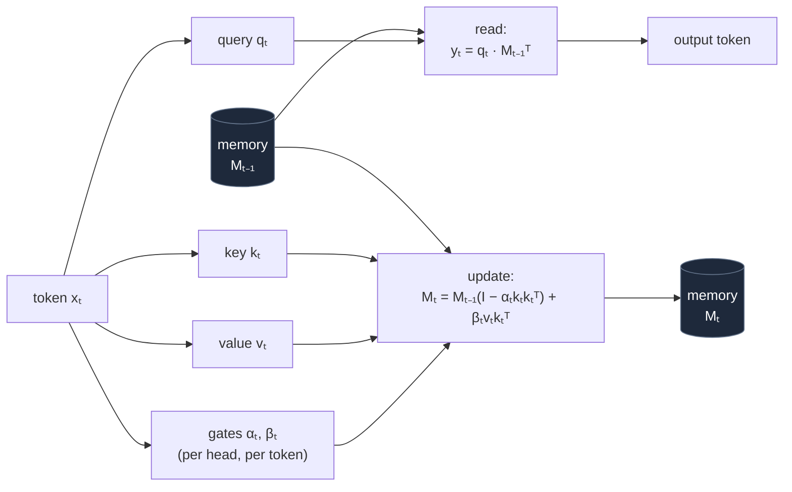
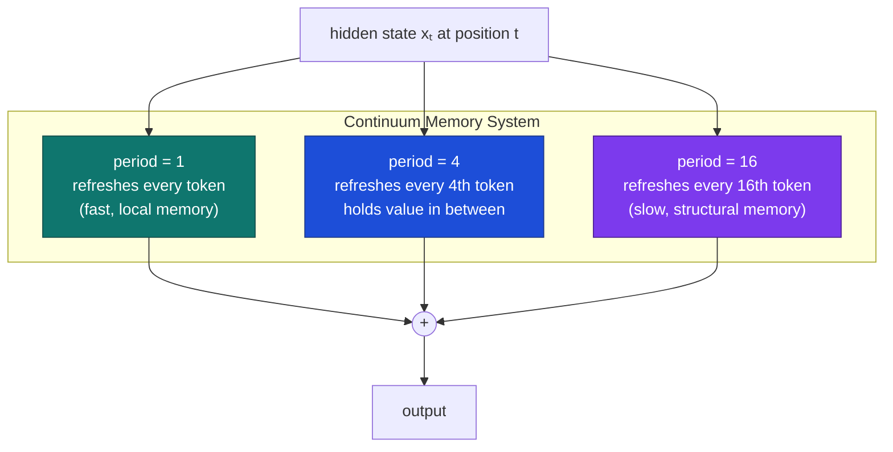

# hope_nano

An unofficial, educational PyTorch implementation of a **Titans-style self-modifying memory layer** with a **multi-rate Continuum Memory System (CMS)**, inspired by Google Research's *Nested Learning* / **HOPE** architecture.

[](https://colab.research.google.com/drive/1RktDXxyAVzWzV0eoH8bGZkFCPd3e6Qax?usp=sharing)
[](LICENSE)
[](https://hf.co/sk16er/hope_nano)
[](https://www.kaggle.com/code/shushank169/notebookcb6e46d855)


---

## What this is
 
Standard Transformers have a fixed context window and no memory beyond it — every token is recomputed against the full history at every step. This project replaces that with a **fixed-size memory matrix `M`** that the model reads *and rewrites* at every single token, plus a second, slower-changing memory for longer-range structure.
 
### 1. The memory update — a gated delta rule
 
At each step, the model reads from memory, then decides how much of its own memory to erase and overwrite before moving on:
 
$$M_t = M_{t-1}\,(I - \alpha_t\, k_t k_t^{\top}) + \beta_t\, v_t k_t^{\top}$$
 
| Term | Meaning |
|---|---|
| $M_{t-1} \to M_t$ | the memory matrix, before and after this token |
| $k_t, v_t$ | this token's key and value vectors |
| $\alpha_t$ | **forget gate** — how much of the old memory along direction $k_t$ to erase |
| $\beta_t$ | **write gate** — how much of the new value to write in |
 
The key detail: $\alpha_t$ and $\beta_t$ are **not fixed constants** — they're predicted per token, per attention head, directly from the input. The model learns *how aggressively to overwrite its own memory* as it reads, token by token, which is what makes this "self-modifying" rather than a static cache.
 

```mermaid
flowchart LR
    X["token xₜ"] --> Q["query qₜ"]
    X --> K["key kₜ"]
    X --> V["value vₜ"]
    X --> AB["gates αₜ, βₜ\n(per head, per token)"]
 
    M0[("memory\nMₜ₋₁")] --> READ["read:\nyₜ = qₜ · Mₜ₋₁ᵀ"]
    Q --> READ
    READ --> OUT["output token"]
 
    M0 --> UPDATE["update:\nMₜ = Mₜ₋₁(I − αₜkₜkₜᵀ) + βₜvₜkₜᵀ"]
    K --> UPDATE
    V --> UPDATE
    AB --> UPDATE
    UPDATE --> M1[("memory\nMₜ")]
 
    style M0 fill:#1e293b,stroke:#64748b,color:#fff
    style M1 fill:#1e293b,stroke:#64748b,color:#fff
```
 
At training time this recurrence is computed with a **chunkwise-parallel scan** rather than a slow Python loop over tokens — the same trick used by DeltaNet — while remaining mathematically identical to the sequential version above.
 
### 2. The Continuum Memory System — memory at multiple speeds
 
A single memory updated every token is good at *recent* context but has no notion of *slow, structural* patterns. The CMS solves this by running several small memory blocks side by side, each refreshing at a different period:
 

```mermaid
flowchart TB
    IN["hidden state xₜ at position t"] --> P1 & P4 & P16
 
    subgraph CMS["Continuum Memory System"]
        direction TB
        P1["period = 1\nrefreshes every token\n(fast, local memory)"]
        P4["period = 4\nrefreshes every 4th token\nholds value in between"]
        P16["period = 16\nrefreshes every 16th token\n(slow, structural memory)"]
    end
 
    P1 --> SUM(("+"))
    P4 --> SUM
    P16 --> SUM
    SUM --> OUT["output"]
 
    style P1 fill:#0f766e,stroke:#134e4a,color:#fff
    style P4 fill:#1d4ed8,stroke:#1e3a8a,color:#fff
    style P16 fill:#7c3aed,stroke:#4c1d95,color:#fff
```
 
Each block only computes a fresh MLP output when `t mod period == 0`; between refreshes it holds its last value — causally, so no block ever peeks at future tokens. Stacking periods `[1, 4, 16]` (configurable via `cms_update_periods`) gives the model fast per-token memory, a mid-range 4-token memory, and a slow 16-token memory, all combined at every layer

## What was fixed vs. the original prototype

An earlier version of this repo had three bugs that silently produced incorrect training dynamics and degraded output quality. They've been fixed and verified with unit tests in `test_equivalence.py`:

| Issue | Before | After |
|---|---|---|
| **Multi-token training with carried state** | Fell through to a single-token-only code path, which computed one aggregated update over the whole chunk instead of a true sequential recurrence | Uses a **chunkwise parallel scan seeded with the carried state**, mathematically equivalent to token-by-token recurrence (verified to ~1e-7) |
| **Forget/write gates (α, β)** | Static, per-head scalars learned once for the whole model | **Per-token, per-head**, predicted from the input at every step |
| **Continuum Memory System** | Config field (`cms_update_periods`) defined but never used — CMS was actually just a single always-on MLP | Real multi-rate stack: each block refreshes causally at its own period and holds its value in between, with state carried across chunks/generation |

Correctness is checked three ways in `test_equivalence.py`:
1. Chunked training output matches true token-by-token recurrent output.
2. The model is strictly causal (perturbing a future token never changes an earlier position's output).
3. Gradients actually flow and reduce loss on a synthetic batch.

## Repository structure

```
config.py                    # HOPEConfig dataclass (model + CMS hyperparameters)
model.py                     # TitansL2 memory layer, multi-rate CMS, HOPEBlock, HOPE model
train.py                     # Local/script training entry point
generate.py                  # Sampling from a checkpoint
test_equivalence.py          # Correctness unit tests (run these before training)
Hope_Demo.py                 # code for the coolab notebook. 
```

## Quickstart

### Colab (recommended — free T4 GPU)
Open the notebook: **[nano_hope_colab.ipynb](https://colab.research.google.com/drive/1RktDXxyAVzWzV0eoH8bGZkFCPd3e6Qax?usp=sharing)**

It will:
- run the correctness unit tests first (fails fast if something's broken, before spending GPU time)
- stream [TinyStories](https://huggingface.co/datasets/roneneldan/TinyStories) and train a ~25–35M parameter model sized for a free T4
- checkpoint to Google Drive every 250 steps and **auto-resume**, since free Colab sessions disconnect unpredictably — just re-run the training cell across multiple sessions
- generate samples and run a needle-in-haystack recall check against a same-size vanilla Transformer baseline

### Local
```bash
pip install -r requirements.txt
python test_equivalence.py   # sanity check first
python train.py              # edit config.py / train.py for your hardware
python generate.py --ckpt <path> --prompt "Once upon a time,"
```

## Trained model

A model trained with this notebook is published at **[hf.co/sk16er/hope_nano](https://hf.co/sk16er/hope_nano)**, including training details and sample outputs.

## Output form the model
```text
Prompt: Once upon a time, 
------------------------------
Once upon a time, there a a a a time big baby door answer flower. the bird loved it who opened it climb around like the hand. It it would so so happy and to girl a she loved reading dress.
```
### Loss graph 


### Output Diff and Max state Diff
> Max Output Diff: 3.576279e-07, Max State Diff: 0.000000e+00

### Validation loss and perplexity


### Titan L2 Alpha/Beta


## Known limitations

- **Educational scale.** This targets ~25–50M parameters on TinyStories, not a production model. Don't expect GPT-3-class output.
- **The needle-in-haystack eval is a qualitative smoke test**, not a rigorous benchmark. A proper comparison needs a matched-size vanilla Transformer baseline evaluated over many random fact positions and distances — contributions welcome.
- **`Hope_Demo.py`** is an earlier, simpler script using ordinary softmax attention with a placeholder "state" residual, not the Titans/CMS architecture in `model.py`. It's kept for reference but isn't what's described above.
- This has not been validated at a scale where any claims about long-context recall advantages over standard Transformers would be statistically meaningful.

## Acknowledgments

Inspired by:
- Behrouz et al., *Titans: Learning to Memorize at Test Time*
- Google Research's *Nested Learning* work introducing the HOPE architecture and Continuum Memory Systems
- Yang et al., *Parallelizing Linear Transformers with the Delta Rule over Sequence Length* (DeltaNet), whose chunkwise-parallel formulation this implementation's memory-update scan is based on

This is an independent, unofficial reproduction and is not affiliated with or endorsed by Google.

## License
MIT — see [LICENSE](LICENSE).

# Links
[](https://colab.research.google.com/drive/1RktDXxyAVzWzV0eoH8bGZkFCPd3e6Qax?usp=sharing)
[](LICENSE)
[](https://hf.co/sk16er/hope_nano)
[](https://www.kaggle.com/code/shushank169/notebookcb6e46d855)

